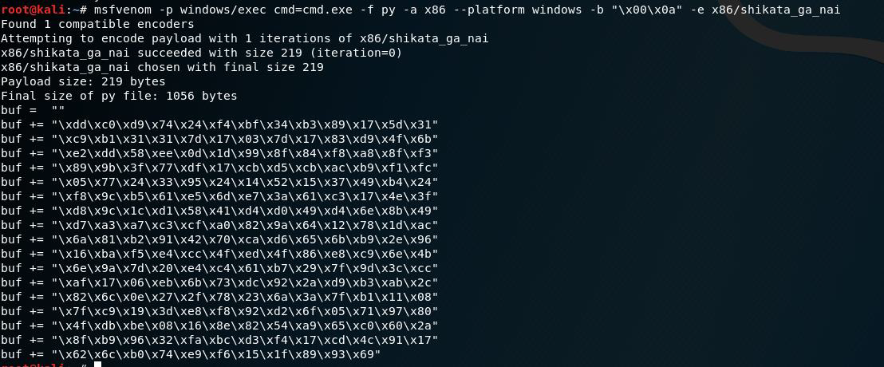

# Buffer Overflow

**Step 1.**&#x20;

**Passing the provided fuzz file breaks the application.**&#x20;

.png>)

**Step 2.**&#x20;

**Checking the fuzz file (.asx) opening with notepad++, Gives us hint that a string starting with http:// and  followed by multiple A characters.**&#x20;

.png>)

**Step 3.**&#x20;

**Create a Python script which can also create a similar file for us.**

.png>)

**Step 4.**&#x20;

**Start Immunity debugger and check if the created .asx file is replacing EIP values. Application crashes with access violation error.**&#x20;

.png>)

**Step 5.**&#x20;

**Now we have to find the exact value for EIP**&#x20;

**5.1 Binary Tree Analysis**&#x20;

**Sending 5000 \* B from last to check if EIP is updating with the value of B.**&#x20;

**Within some try we found that sending a \* 15000 and b \* 5000, updates the EIP value  with B.**

.png>)

.png>)

**5.2 Sending Unique string** &#x20;

**• Now as we know in the buffer length of 20000, EIP value updates with B within  the last 5000 so we can use msfvenom script “pattern\_create.rb” to create 5000 unique characters.**&#x20;

.png>)

**• After updating the code with unique characters , we got the below result:**

.png>)

**• Now, checking the exact location of the found value.**&#x20;

**• We can do this by another msfvenom script “pattern\_offset.rb”**&#x20;

.png>)

**5.3 Basic calculation**&#x20;

**A (15000 + 2417 = 17417) + 4 \*B(value of EIP) + remaining buffer (20000-17417-4)\*C**&#x20;

**Updating the code as required :**&#x20;

.png>)

**We are able to control EIP.**

.png>)

**Step 6.**&#x20;

**Now we have to check the Bad characters which are either truncate the buffer or terminate the buffer. So sending all possible combination in the code.**&#x20;

**After analysis, we found that the Bad character are null byte \x00 and carriage return \x0a**

.png>)

.png>)

**Step 7.**&#x20;

**Now we have to find any module which does not have any protection like ASLR,REBASE,SEH,DEP,etc. To Do so we will use mona.py script within immunity debugger.**&#x20;

**By using command “!mona modules”**&#x20;

**we are able to identify such module which is:**&#x20;

**Log data, item 32**&#x20;

**Address=0BADF00D**&#x20;

**Message= 0x10000000 | 0x1007f000 | 0x0007f000 | False | False | False | False | False | -1.0- \[MSA2Mfilter03.dll] (C:\Program Files (x86)\Mini-stream\ASX to MP3 Converter\MSA2Mfilter03.dll)**

.png>)

**We can use search command in the module or search sequence string** &#x20;

**Search command -> jmp esp (which is not found in the module)**&#x20;

**Search sequence -> push esp**&#x20;

&#x20;**retn**&#x20;

.png>)

**Found the reliable address in memory which contain PUSH ESP and next instruction as RETN found on  address:**&#x20;

**1003DF73 54 PUSH ESP**&#x20;

**1003DF74 C3 RETN**&#x20;

**Step 8.**&#x20;

**Now as we have found the Address for PUSH ESP instruction which is also not having any of our bad  characters, we can pass it in our EIP using the below code.**

.png>)

**We can see from the below screenshot we are able to PUSH ESP address into our instruction pointer  which is EIP.**&#x20;

.png>)

**Step 9.**&#x20;

**Now we are ready to pass our shell code into the remaining buffer.**

**To do so we need a shell code which we can get using the msfvenom.**&#x20;

**We also know that our esp register points to the beginning of our shell code we need to provide some  stack space to work the decoder which is automatically generated by msfvenom.**&#x20;

**We will add no operation input (nops) in the code “\x90”.**&#x20;

.png>)

**Step 10.**&#x20;

**Getting the cmd prompt.**

.png>)

.png>)

.png>)

**Getting the cmd prompt opening using vulnerable application.**

.png>)

.png>)
